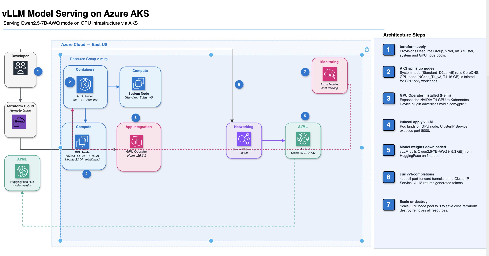

## Production-Grade LLM Serving with vLLM on Azure AKS
(Terraform + NVIDIA GPU Operator + T4)

Provision a GPU on **Azure AKS with Terraform**, install the **NVIDIA GPU Operator**, and serve
**Qwen2.5-7B-Instruct-AWQ** through **vLLM's OpenAI-compatible API** — a production-shaped
inference endpoint, reachable via `curl /v1/completions`.



**Done when:** `curl .../v1/completions` returns tokens from a GPU node Terraform created, and
every engine flag can be justified against the GPU's measured limits.

Full topology in **[docs/architecture.md](docs/architecture.md)**.

---

## What's actually being deployed

There is no app and no dataset here. The deliverable is an **inference API**: an HTTP endpoint
that takes a prompt and returns generated text. Everything below exists to get one model onto
one GPU and keep it serving.

| Layer | Tool | What it does here |
|---|---|---|
| Provisioning | **Terraform** | Declares the resource group, AKS cluster and GPU node pool as code. Reproducible, destroyable in one command. |
| Orchestration | **Kubernetes (AKS)** | Schedules the serving container onto the GPU node, restarts it when it dies, handles networking. |
| GPU enablement | **NVIDIA GPU Operator** | Makes Kubernetes aware the GPU exists. Without it the scheduler sees a plain machine and `nvidia.com/gpu` is never advertised. |
| Serving engine | **vLLM** | Loads the model onto the GPU and serves it. PagedAttention + continuous batching are what make it fast. |
| Model | **Qwen2.5-7B-Instruct-AWQ** | The payload. 4-bit quantized, so a 7B model fits on a 15 GiB card with room for KV cache. |
| Package manager | **Helm** | Installs the GPU Operator chart via Terraform's `helm_release`. vLLM is plain `kubectl apply`. |
| Test client | **curl** | Hits `/v1/completions`. That response is the checkpoint. |

Someone else trains the model; this project deploys and serves it. That split is the AI
infrastructure engineer's job.

## Why self-host instead of calling an API?

- **Cost at scale** — per-token API pricing stops making sense past a certain volume.
- **Data and privacy** — prompts never leave your network.
- **Model and latency control** — run whatever model you want, tune the engine, own the tail
  latency instead of inheriting someone else's.

## Open source vs closed source models

**Open source** — the weights are downloadable (Hugging Face and similar). You get the actual
parameter file, can run it on your own GPU, fine-tune it, and inspect it, with no per-token fee.
Examples: Llama, Qwen, Mistral, DeepSeek.

**Closed source** — you only get an API endpoint (GPT, Claude, Gemini). No weights, no
self-hosting: you send a prompt over HTTPS and pay per token.

**You cannot self-host a closed model — there are no weights to put on a GPU.** That is why this
project serves Qwen: an open-weight model is the precondition for everything below.

## Why Kubernetes

A single GPU box running `python -m vllm...` would serve tokens too. Kubernetes earns its place
on what comes after:

- **Scheduling** — GPUs become a countable resource (`nvidia.com/gpu: 1`), not just a machine.
- **Isolation** — taints and resource requests keep cheap pods off the expensive card and stop
  two containers fighting over one GPU.
- **Self-healing** — the pod dies, it restarts behind a stable Service address.
- **Autoscaling** — HPA/KEDA on the pod, node pool to zero between sessions.
- **Rollouts** — canary and blue/green are built-in primitives, not scripts.
- **Ecosystem** — GPU Operator, DCGM metrics, MIG and time-slicing all ship as Kubernetes
  components.
- **Portability** — the same manifests run on any cloud's managed Kubernetes.

AKS specifically: Azure runs the control plane for free (`sku_tier = "Free"`), and node pools
are a first-class resource, so the GPU pool is one Terraform block.

---

## The driver decision

AKS can install an NVIDIA driver for you. This project deliberately tells it not to:

```hcl
gpu_driver = "None"     # aks.tf      — Azure does NOT install a driver
driver.enabled = true   # gpu-operator.tf — the Operator owns the full stack
```

**Why hand the driver to the Operator rather than the node image?** The driver's lifecycle
becomes decoupled from the OS image. You can upgrade or pin it per node pool without rebuilding
an image, drift between nodes stops being invisible, and the driver, container toolkit, device
plugin, node-feature-discovery and DCGM exporter all arrive as one Helm-versioned, mutually
validated stack.

**The cost is cold start.** The driver DaemonSet must pull, install and pass health checks
before the node can schedule GPU pods at all. That is a real tradeoff, not a free win.

---

## Hardware

**GPU node** — 1× `Standard_NC4as_T4_v3`: NVIDIA **T4, Turing (SM 7.5)** with **16GB VRAM**,
plus 4 vCPU and 28GB host RAM, $0.684/hr. Runs the vLLM pod and the Operator's DaemonSets. Tainted
`nvidia.com/gpu=present:NoSchedule` so nothing else lands on it.

**System node** — 1× `Standard_D2s_v3`: 2 vCPU, 8GB RAM, $0.125/hr. Required by AKS; runs
CoreDNS and the Operator's controllers, keeping cluster overhead off the expensive card.

Measured on the running cluster:

```
$ kubectl exec -n gpu-operator daemonset/nvidia-driver-daemonset -- \
    nvidia-smi --query-gpu=name,memory.total,compute_cap,driver_version --format=csv

name, memory.total [MiB], compute_cap, driver_version
Tesla T4, 15360 MiB, 7.5, 580.126.20
```

Two values drive every flag below:

- **15360 MiB usable** (~15 GiB) — the T4 is listed as a 16GB card. Budget against the measured
  number.
- **`compute_cap 7.5`** — determines which vLLM kernels are available.

### Engine flags, and why each one

| Flag | Value | Reason |
|---|---|---|
| `--quantization` | `awq` | Marlin kernels require **SM 8.0+**; this card is SM 7.5, so vLLM uses the original AWQ GEMM path. |
| `--dtype` | `float16` | Turing has **no bfloat16** support at all. |
| `--enforce-eager` | set | Skips CUDA-graph capture. Costs some latency, returns KV-cache headroom. |
| `--gpu-memory-utilization` | `0.90` | Leaves ~10% for fragmentation and non-vLLM allocations. |
| `--max-model-len` | `4096` | KV cache scales linearly with context length. |
| `--max-num-seqs` | `8` | KV cache also scales with concurrency. |

**Why 4-bit AWQ is doing the heavy lifting:** the same 7B model in FP16 would be ~14GB of
weights alone — it would technically load on a 15 GiB card and leave essentially nothing for
KV cache, serving one short request at a time or OOMing. Quantization is what makes a 7B model
practical on a T4 at all.

### GPU Mathematics

This is **VRAM on the card only** — the node's 28GB host RAM is a separate pool and never
holds the model
```
15.00 GiB  total card (15360 MiB via nvidia-smi)
│
├── 13.29 GiB  vLLM's budget  (15.00 x 0.90, the utilization cap)
│   ├── 5.97 GiB  weights + runtime overhead (AWQ 4-bit, activations, CUDA context)
│   └── 7.32 GiB  KV cache  <- what's left over is what serves concurrency
│
└──  1.71 GiB  untouched headroom (the other 10%)
```

Weights are fixed, so **KV cache is the remainder** — raise `--gpu-memory-utilization` and
every extra byte goes to KV cache, i.e. concurrency, at the cost of OOM headroom.

Note- KV cache is model's memory of every token - the attention key & value it stores, So it never recomputes them when genenrating token


```
INFO [gpu_worker.py:466]      Available KV cache memory: 7.32 GiB
INFO [kv_cache_utils.py:1733] GPU KV cache size: 137,072 tokens
INFO [kv_cache_utils.py:1734] Maximum concurrency for 4,096 tokens per request: 33.46x
```

KV cache — not weights — sets the concurrency ceiling. Note vLLM reports headroom for
**33.46 concurrent requests** while `--max-num-seqs=8` caps it at 8. That 8 is conservative;
the measurement says there is ~4x more available. Worth raising and re-testing under load.

---


## War Stories

Full detail on both in **[docs/project-summary.md](docs/project-summary.md)**.

---

## Pinned versions

| Component | Pin |
|---|---|
| Terraform | ~> 1.15 |
| azurerm provider | ~> 4.0 |
| kubernetes / helm providers | ~> 2.35 / ~> 2.17 |
| AKS Kubernetes version | `null` (AKS default for the region) |
| GPU VM | `Standard_NC4as_T4_v3` (T4, 15 GiB usable) |
| GPU node OS | **`Ubuntu2204`** (containerd 1.7 — see traps above) |
| System VM | `Standard_D2s_v3` |
| GPU Operator chart | v26.3.2, **`driver.enabled=true`** |
| vLLM image | `vllm/vllm-openai:v0.22.1` (never `:latest`) |
| Model | `Qwen/Qwen2.5-7B-Instruct-AWQ` (ungated — no HF token needed) |

Pinning the vLLM image matters more than it looks: `:latest` changes engine defaults under you,
and a config that worked yesterday OOMs today. On a 15 GiB card that margin is thin.

---

## Project layout

```
vllm-serving-aks/
  terraform/
    versions.tf      # provider pins + HCP backend (workspace: vllm-serving-aks, LOCAL exec)
    providers.tf     # azurerm (no RP auto-register), kubernetes + helm via kube_config certs
    variables.tf     # location, cluster_name, vm sizes
    aks.tf           # resource group + AKS cluster + GPU node pool
    gpu-operator.tf  # helm_release nvidia/gpu-operator (driver.enabled=true)
    outputs.tf       # cluster name, resource group, the get-credentials command
  k8s/
    vllm-deployment.yaml  # Deployment + ClusterIP Service
  scripts/
    verify.sh             # wait -> port-forward -> curl -> nvidia-smi -> KV-cache logs
  imp-commands.md         # every command used, with what/why
```

**There is no networking file.** AKS provisions the VNet itself, into a separate `MC_*` resource
group it owns. Convenient, but it means the network is not in your state file, your diff, or
your cost reasoning — and hand-editing that resource group doesn't stick, because AKS
reconciles it away. If you need real control (custom CIDRs, private cluster, VNet peering),
switch to a BYO VNet with `azurerm_virtual_network` + `vnet_subnet_id`.

The GPU Operator lives in Terraform so `terraform destroy` cleans it up with everything else.
vLLM stays a plain manifest — a single Deployment doesn't need a chart, and editing YAML beats
re-templating while iterating on engine flags.

---

## Setup

You need the Azure CLI, Terraform, kubectl and Helm locally, plus **approved `NCASv3_T4` GPU
quota** and four hand-registered resource providers. Full prerequisites and per-step verify
checks in **[docs/setup.md](docs/setup.md)**.

Every command actually used, with what and why, is in **[imp-commands.md](imp-commands.md)**.
The problems hit along the way are in **[docs/project-summary.md](docs/project-summary.md)**.

---

## Build sequence

The short version — full commands in [imp-commands.md](imp-commands.md):

1. **Pre-flight.** Confirm `NCASv3_T4` quota, register the four resource providers, confirm the
   SKU has no regional restrictions, and query real pricing.
   *Check:* quota shows `0/4`; all four providers `Registered`; `restrictions=NONE`.
2. **HCP workspace.** `vllm-serving-aks` in org `Shikha_Projects`, **Execution Mode = Local**.
   *Check:* `terraform init` says "HCP Terraform has been successfully initialized".
   Remote execution would fail — azurerm authenticates off the local `az login` session.
3. **`terraform apply`** → resource group, AKS, GPU pool, GPU Operator (4 resources, ~10-15 min).
   *Check:* `kubectl get nodes -o wide` shows 2 `Ready` nodes, GPU pool on containerd 1.7.
4. **GPU visible to Kubernetes.**
   *Check:* `kubectl describe node -l workload=gpu | grep nvidia.com/gpu` shows `1`.
   **This is the real checkpoint** — until that number appears the vLLM pod stays `Pending`.
   If it never appears, check the Operator DaemonSets' tolerations first.
5. **`kubectl apply -f k8s/vllm-deployment.yaml`.** First boot ~10 min (~11GB image + weights).
   *Check:* pod schedules on the GPU node, logs show the KV-cache line, `/health` returns 200.
6. **`scripts/verify.sh`.**
   *Check:* ends with `✅ Project verification complete.`
7. **`terraform destroy`.** Non-negotiable — see cost below.
   *Check:* `az vm list-usage` shows `CurrentValue` back to `0`.

---

## Cost

| Component | $/hr |
|---|---|
| GPU node `Standard_NC4as_T4_v3` (Linux, on-demand) | **0.684** |
| System node `Standard_D2s_v3` | 0.125 |
| AKS control plane (`sku_tier = "Free"`) | 0.000 |
| **Total** | **~0.81** |

| State | ~$/hr | Notes |
|---|---|---|
| **Active** | **~0.81** | The only state where the GPU bills |
| **Destroyed** | **$0** | `terraform destroy` — removes the whole resource group |

Against a $50/month ceiling that is **~62 hours of uptime for the entire month**. A
build → verify → teardown session runs ~1.5–2 hrs ≈ **$1.20–1.60**. The risk is never one
session — it's forgetting to destroy: 24 idle hours ≈ **$19**, over a third of the budget.

Because the AKS control plane is free, there is no cheap "scaled to zero" middle state worth
keeping. Destroying everything costs nothing but a ~15 min rebuild. **Destroy by default.**

**Spot would cut the GPU 71% ($0.684 → $0.198/hr) but is currently blocked**: the subscription's
`Total Regional Low-priority vCPUs` is **3**, and `NC4as_T4_v3` needs **4**. Spot and on-demand
draw from separate quota pools. Raising that single limit is by far the highest-leverage cost
action here — the GPU is ~84% of the bill, so it beats any VM-size tuning.

## Guardrails

- **`terraform destroy` after every session.** The resource group is Terraform-managed, so one
  destroy removes the cluster, both node pools, disks and the managed identity — and keeps state
  in sync, which `az group delete` would not. There is no cheap idle state to fall back on.
- **Verify the quota released** — `az vm list-usage` should show `CurrentValue` back to `0`.
  It is subscription-wide, so a stuck node blocks the next build.
- **Tag everything `project=vllm-serving-aks`** (set in `aks.tf`) so cost analysis can attribute
  spend.
- **Set an Azure Cost Management budget alert.** That is the backstop for the night you forget —
  24 idle hours is ~$19, over a third of a $50 monthly ceiling.

---

## Important questions this project answers-

**What does the GPU Operator install, and why not hand-install drivers?**
Driver, container toolkit, device plugin, node-feature-discovery and DCGM exporter — as one
Helm-versioned, mutually validated stack. Hand-installing couples the driver to the node image:
you rebuild an image to bump a driver, and drift between nodes becomes invisible. The Operator
decouples that lifecycle, at the cost of slower cold start.

**Trace a request through vLLM.**
HTTP hits the OpenAI-compatible server → tokenized → scheduled into a **continuous batch**
(new requests join a running batch instead of waiting for it to drain) → attention runs against
a **paged** KV cache (fixed-size blocks, so memory isn't pre-reserved per sequence and
fragmentation stays low) → tokens stream back. Those two mechanisms are why throughput holds up
under concurrency.

**What sets the concurrency ceiling?**
KV cache, not weights. `--gpu-memory-utilization` sets the total budget; weights take a fixed
slice; what remains divided by `max-model-len × max-num-seqs` is how many concurrent requests
fit. Measured here: 7.32 GiB of KV cache = 137,072 tokens = 33.46x concurrency at 4096 tokens.

**How bad is cold start?**
Three stacked costs: ~11GB image pull, model weight download, then GPU init — plus the
Operator's driver DaemonSet must install the driver before the node can schedule GPU pods at
all. That is why `startupProbe.failureThreshold` is 60 (10 min) rather than a default.

---

## Future enhancements

- **External access.** Replace `port-forward` with an AKS Ingress (or `Service type=LoadBalancer`)
  plus TLS, so the endpoint doesn't need a live `kubectl` session.
- **Model weight caching.** Back the HF cache with an Azure Files / managed-disk PV so the weight
  download doesn't repeat on every pod restart.
- **Raise `--max-num-seqs`.** Measured headroom is 33.46x versus the configured 8. Raise and
  re-measure under load.
- **Raise low-priority quota → move to Spot.** The single biggest cost win available (~60% off
  the total). Requires handling eviction: a 2-minute warning, graceful pod drain, and accepting
  interrupted in-flight requests.
- **Workload Identity Federation for HCP Terraform.** The workspace currently runs in Local
  execution mode against a local `az login`. OIDC would remove that dependency and allow true
  remote runs.
