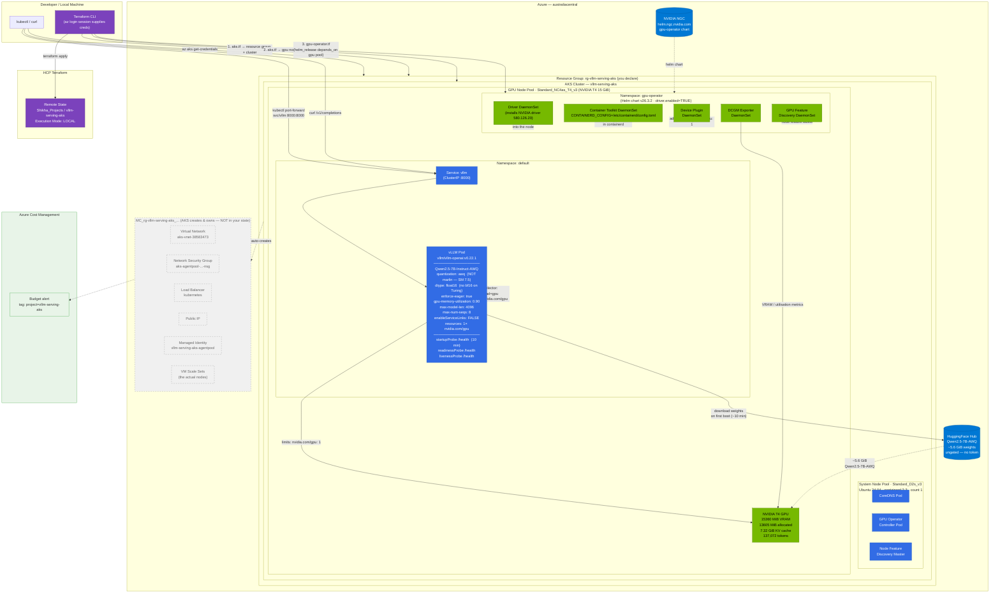

# Architecture Diagram — vLLM Serving on AKS

---

## Component Summary

| Layer | Component | Detail |
|---|---|---|
| **Provisioning** | Terraform + HCP Terraform | Declares all infra as code; **Local execution** — azurerm auth comes from the local `az login` |
| **Network** | AKS-managed VNet | **Not declared** — AKS creates it in the `MC_*` resource group. No `vpc.tf` equivalent |
| **Orchestration** | AKS (`sku_tier = "Free"`) | Managed control plane at **$0**; system-assigned managed identity |
| **System Node** | `Standard_D2s_v3` — count 1 | Ubuntu 24.04 / containerd 2.3. Runs CoreDNS, GPU Operator controller, NFD master |
| **GPU Node** | `Standard_NC4as_T4_v3` (T4 15 GiB) — count 1 | **Pinned to Ubuntu 22.04 / containerd 1.7**; `gpu_driver = "None"`; tainted `nvidia.com/gpu=present:NoSchedule` |
| **GPU Operator** | Helm chart v26.3.2 | **`driver.enabled=true`** — owns driver + toolkit + device plugin + DCGM + GFD as one stack |
| **Serving Engine** | vLLM `v0.22.1` | OpenAI-compatible API on `:8000`; PagedAttention + continuous batching |
| **Model** | `Qwen2.5-7B-Instruct-AWQ` | 4-bit AWQ → ~5.6 GiB weights, **7.32 GiB KV cache** on the T4 |
| **Access** | ClusterIP Service + `kubectl port-forward` | No public load balancer; developer access only |

## Two things the diagram makes visible

**1. The GPU Operator owns the whole driver stack.** `gpu_driver = "None"` on the node pool plus
`driver.enabled=true` on the chart means Azure installs nothing and the Operator installs
everything — driver, toolkit, device plugin. That decouples driver lifecycle from the node image,
at the cost of a slower cold start.

**2. Most of the network is not yours.** The greyed `MC_*` box is created and owned by AKS. It
holds the VNet, NSG, load balancer, public IP, managed identity and the VM Scale Sets that are the
actual nodes — none of it in your Terraform state. Convenient, but invisible to your diff and your
cost reasoning. Never hand-edit it; AKS reconciles changes away.

## Cost States

| State | ~$/hr | Running |
|---|---|---|
| **Active** | ~$0.81 | Everything — GPU $0.684 + system $0.125 + control plane $0 |
| **Destroyed** | $0 | Nothing (`terraform destroy`) |

There is deliberately **no middle state**: the control plane is free, so a stopped cluster saves
nothing worth the complexity. Destroy by default.
